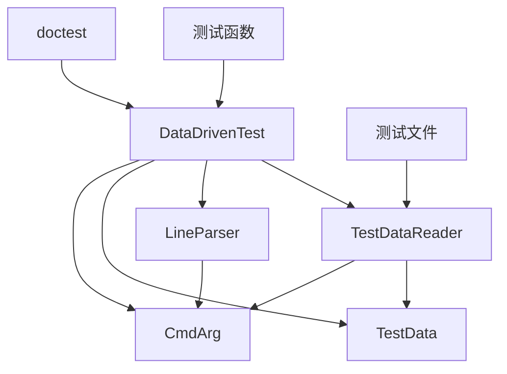

# Data Driven 测试框架设计文档

## 概述

本文档描述了基于 raft-rs 的 data driven 测试框架的 C++ 实现设计。该框架允许将测试数据和测试逻辑分离，通过文本文件定义测试用例，使测试更加灵活和易于维护。

## 核心概念

### 1. 测试数据格式

测试数据文件使用以下格式：

```
# 注释行以 # 开头
command [arg | arg=val | arg=(val1, val2, ...)]... \
<more args> \
<more args>
----
<expected results>
<blank line>
```

### 2. 支持的参数格式

- `key` (无值)
- `key=` (空值)
- `key=()` (空值)
- `key=a` (单个值)
- `key=a,b,c` (逗号分隔的单个值)
- `key=(a,b,c)` (多个值)

## 架构设计

### 核心组件



### 1. 核心数据结构

#### CmdArg
```cpp
struct CmdArg {
    std::string key;
    std::vector<std::string> vals;
    
    // 便利方法
    bool HasValue() const;
    std::string GetValue() const;
    std::vector<std::string> GetValues() const;
};
```

#### TestData
```cpp
struct TestData {
    std::string pos;           // 文件位置信息
    std::string cmd;          // 命令名
    std::vector<CmdArg> args; // 命令参数
    std::string input;        // 输入数据
    std::string expected;     // 期望输出
    
    // 便利方法
    bool ContainsKey(const std::string& key) const;
    std::optional<CmdArg> GetArg(const std::string& key) const;
};
```

### 2. 解析器组件

#### LineParser
负责解析单行命令参数：
```cpp
class LineParser {
public:
    static std::pair<std::string, std::vector<CmdArg>> ParseLine(const std::string& line);
    
private:
    static std::vector<std::string> SplitDirectives(const std::string& line);
    static CmdArg ParseArgument(const std::string& arg);
};
```

#### TestDataReader
负责读取和解析整个测试文件：
```cpp
class TestDataReader {
public:
    TestDataReader(const std::string& filename, const std::string& content, bool rewrite = false);
    
    bool NextTest();
    const TestData& GetCurrentTest() const;
    
private:
    void ReadExpected();
    void EmitLine(const std::string& line);
    
    std::string filename_;
    std::istringstream content_;
    TestData current_test_;
    bool rewrite_mode_;
    std::optional<std::string> rewrite_buffer_;
};
```

### 3. 测试运行器

#### DataDrivenTest
主要的测试运行器：
```cpp
class DataDrivenTest {
public:
    using TestFunction = std::function<std::string(const TestData&)>;
    
    static void RunTest(const std::string& path, TestFunction func, bool rewrite = false);
    static void WalkTests(const std::string& path, std::function<void(const std::string&)> func);
    
private:
    static void RunSingleTest(const std::string& filename, const std::string& content, 
                           TestFunction func, bool rewrite);
    static void RunDirective(TestDataReader& reader, TestFunction func);
    static bool HasBlankLine(const std::string& str);
};
```

## 文件结构

```
include/raftpp/datadriven/
├── test_data.h      // TestData 和 CmdArg 定义
├── line_parser.h    // LineParser 类
├── test_reader.h    // TestDataReader 类
└── datadriven.h     // DataDrivenTest 主类

lib/datadriven/
├── test_data.cc
├── line_parser.cc
├── test_reader.cc
└── datadriven.cc

tests/testdata/
├── example_test/
│   ├── test_001.txt
│   └── test_002.txt
└── datadriven_test.cc
```

## 使用示例

### 1. 定义测试数据文件 (test_001.txt)

```
# 计算斐波那契数列
fibonacci a=3 b=4 c=5
----
a=3
b=5
c=8

# 计算阶乘
factorial a=3 b=4
----
a=6
b=24
```

### 2. 编写测试函数

```cpp
#include "raftpp/datadriven/datadriven.h"

std::string TestMathFunctions(const raftpp::datadriven::TestData& data) {
    std::string result;
    
    if (data.cmd == "fibonacci") {
        for (const auto& arg : data.args) {
            int n = std::stoi(arg.GetValue());
            int fib = Fibonacci(n);
            result += arg.key + "=" + std::to_string(fib) + "\n";
        }
    } else if (data.cmd == "factorial") {
        for (const auto& arg : data.args) {
            int n = std::stoi(arg.GetValue());
            int fact = Factorial(n);
            result += arg.key + "=" + std::to_string(fact) + "\n";
        }
    }
    
    return result;
}

TEST_CASE("Math functions data driven test") {
    raftpp::datadriven::DataDrivenTest::RunTest(
        "tests/testdata/math_functions", 
        TestMathFunctions
    );
}
```

## 实现特性

### 1. 从 raft-rs 移植的核心特性

- **命令行参数解析**：支持多种参数格式
- **多行输入支持**：使用 `\` 续行
- **空白行处理**：支持在期望输出中包含空白行
- **重写模式**：自动更新测试数据文件

### 2. C++ 特有的增强

- **类型安全**：使用强类型参数解析
- **异常处理**：使用 C++ 异常机制处理错误
- **STL 集成**：充分利用标准库容器和算法
- **doctest 集成**：与现有测试框架无缝集成

## 错误处理

1. **解析错误**：抛出 `ParseException` 包含行号和错误信息
2. **文件错误**：使用标准文件系统异常
3. **断言失败**：集成 doctest 的断言机制

## 性能考虑

1. **延迟解析**：只在需要时解析测试数据
2. **内存管理**：使用 RAII 管理资源
3. **缓存机制**：可选的解析结果缓存

## 扩展性

1. **自定义解析器**：支持注册自定义参数解析器
2. **输出格式化**：支持多种输出格式
3. **钩子机制**：支持测试前后的自定义操作